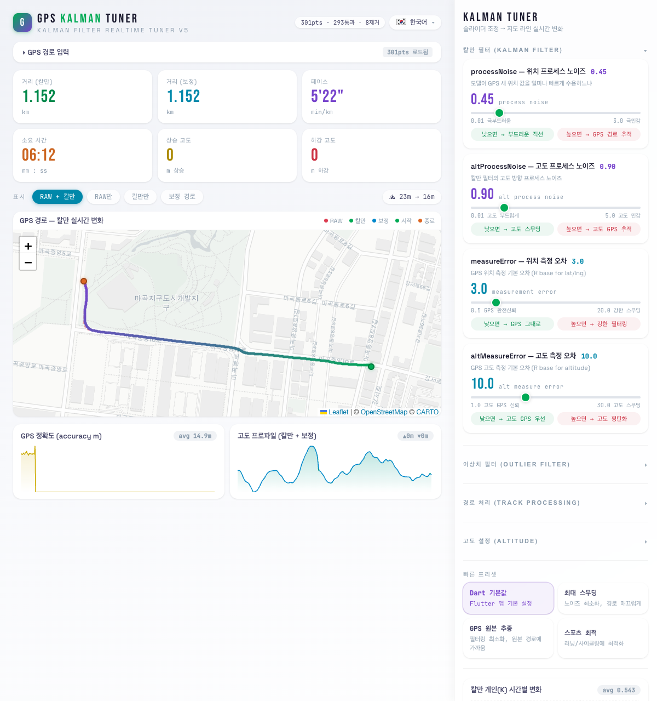

# GPS Kalman Tuner

A browser-based tool for visualizing and tuning Kalman filter parameters on GPS route data. Adjust filter settings with real-time sliders and instantly see how they affect your GPS track on an interactive map.

Ported from a production Flutter/Dart GPS tracking app — same algorithms, now tunable in the browser.



## Getting Started

```bash
# Install dependencies
npm install

# Start development server
npm run dev
```

Open [http://localhost:5173](http://localhost:5173) in your browser.

## Usage

1. **Load GPS data** — Paste JSON or upload a file via the GPS Route Input panel
2. **Adjust parameters** — Use the sliders in the right panel to tune filter settings
3. **Compare results** — Switch between RAW, Kalman, and Refined views on the map
4. **Try presets** — Quick-switch between Dart Default, Max Smoothing, GPS Faithful, and Sport Optimized

### Supported GPS Data Formats

```json
// Array of arrays: [lat, lng, alt, timestamp_ms, accuracy_m]
[[37.563, 126.839, 19.0, 1773096259000, 23.1], ...]

// Array of objects
[{ "lat": 37.563, "lng": 126.839, "alt": 19.0, "timestamp": 1773096259000, "accuracy": 23.1 }, ...]
```

## Built With

- React 19 + TypeScript — UI framework
- Vite — Build tool
- Zustand — State management
- Leaflet — Interactive map
- Recharts — Data visualization

## Scripts

| Command | Description |
|---------|-------------|
| `npm run dev` | Start dev server |
| `npm run build` | Production build |
| `npm run preview` | Preview production build |
| `npm run lint` | Run ESLint |

## License

MIT
